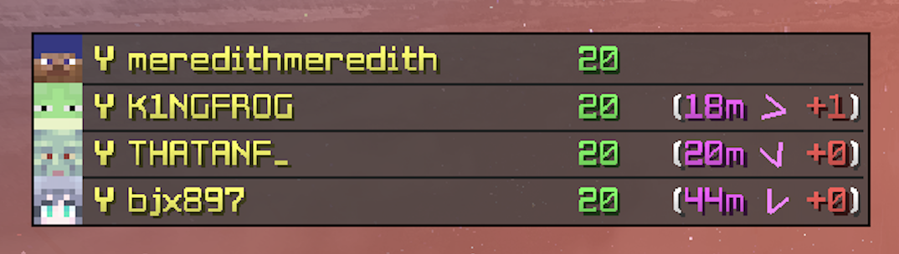

# WeaveFks

> Mega Walls Final Kills Counter Mod for Weave (Supports Lunar Client & more launchers to come!)

## Commands

### Squad HUD
| Command | Description |
|---------|-------------|
| `/squad add <username>` | Adds user to the squad HUD |
| `/squad remove <username>` | Removes user from the squad HUD |
| `/squad clear` | Clears squad HUD |
| `/phudpos <x> <y>` | Moves HUD position |

### Compass HUD
| Command | Description |
|---------|-------------|
| `/compass <x> <y>` | Sets compass position |
| `/compassscale <scale>` | Sets compass scale |
| `/compasstoggle` | Toggles between keypress only (U) or permanent view |

### Finals Display
| Command | Description |
|---------|-------------|
| `/displayfinalscounter` | Toggles HUD |
| `/setpos <x> <y>` | Sets HUD X and Y position |
| `/setscale <scale>` | Sets HUD scale |
| `/finalsintab` | Toggles finals in tab *(Currently not working)* |
| `/finals` | Prints team finals to personal chat |
| `/fks say` | Say finals to your team |
| `/playerfinals` | Prints player finals to chat |
| `/resetfinals` | Resets finals count |

### Regen Timer
| Command | Description |
|---------|-------------|
| `/regenscale <scale>` | Sets regeneration timer scale |
| `/regenpos <x> <y>` | Sets position of regen timer |

### Energy Display
| Command | Description |
|---------|-------------|
| `/energy` | Toggles energy display on/off |
| `/energypos <x> <y>` | Sets position of energy display |